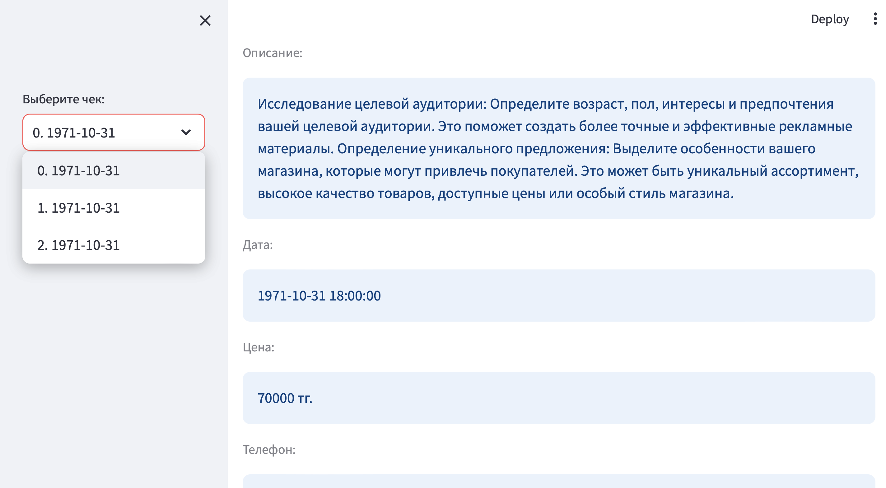

An adaptive admin panel for viewing and validating cheques, written on `Streamlit` and `MongoDB`.

# Installation
```bash
> pip install -r ./requirements.txt
```

# Launching
```bash
> streamlit run main.py
```

# Screenshots

